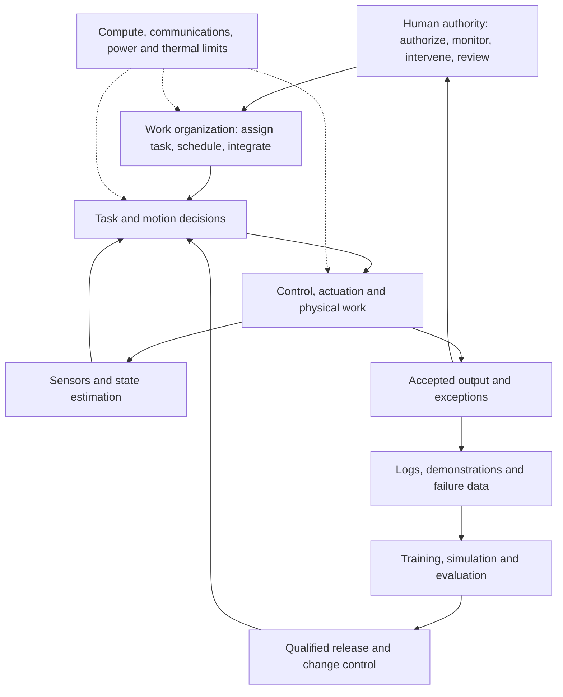

# Understanding Chinese autonomy: authority, capability and deployment

Research foundation: 10 September 2026; military-domain and organizational-doctrine extensions added 15 September. Start with the [military ecosystem guide](../military-robotics/README.md) for the institution, platform and procurement map. Read this synthesis and the [worked-case analyst brief](cases/README.md), then the [doctrine sourcebook](doctrine.md), [technical evidence map](stack.md) and [deployment economics](../industrial-base/task-economics/README.md). The [research queue](questions.json) records progress and the evidence that would change the analysis.

Two companion readings connect the stack to industry: the [civilian production and sourcing baseline](../military-robotics/civilian-base.md) compares production, installations, supplier share and Unitree sourcing; the [five-layer reuse study](../military-robotics/civilian-reuse.md) examines components, interfaces, training resources, task integration and assurance.

**The productive unit of analysis is a function, performed under stated conditions, with a stated division of human and machine responsibility.** A company or a chassis is too broad. A robot can balance autonomously, receive its destination from a person, flag an anomaly with uncertain accuracy, and require a technician to recover after a fault. Calling the whole system autonomous conceals the questions an analyst needs to answer.

China's public policy clearly favors unmanned and intelligent systems. The harder research problem is connecting that direction to a specific allocation of authority, a working technical system and a repeatable operational result. Keep those three claims separate.

## What “doctrine” can mean in this evidence base

| Kind of source | What it tells us | How to use it |
|---|---|---|
| Promulgated military regulation | Rules or institutional requirements, where its actual text is available | The 2020 Joint Operations Outline announcement establishes that a regulation exists. Its autonomy provisions were not reviewed. Do not reconstruct them from commentary. |
| Official institutional decision | An announced organization and its assigned role | [D09](doctrine.md#d09--information-support-force-an-implemented-institutional-decision) supplies a dated institutional anchor; a mission statement is not a system specification or procurement mandate. |
| National plan or policy white paper | Development priorities and declared policy | Use for direction, authority and industrial priorities, not proof of a deployed capability. |
| Signed military newspaper/research article | An author's proposed concepts and arguments | Track authors, institutions and repetition. Publication on a military website does not make every proposal binding doctrine. |
| Exercise or demonstration report | A reported event under particular conditions | Identify the exact function and remaining human work; an appearance is not routine operational effectiveness. |
| Acceptance or operating record | Tested performance for a defined system and task | Most valuable for closing the gap between aspiration and capability; scope and provenance still matter. |

The formal anchor for modernization is the approved 2026–2030 national plan: chapter 55 links unmanned/intelligent forces to wider military information-system development; chapter 56 addresses civilian technology transfer and standards compatibility. This is an industrial and institutional agenda, not a supplier list. [Authorized plan text, chapters 55–56](https://www.news.cn/politics/20260313/085af5de5a4b4268aa7d87d90817df2f/c.html).

The declared human-control anchor is the 2025 arms-control white paper. It retains human primacy and ultimate responsibility and calls for preventing unauthorized actions. That does not tell us which decisions a particular operator must approve, how supervision works, or whether interruption is reliable in a deployed system. [White paper, Part IV, military AI subsection](https://www.mfa.gov.cn/web/wjb_673085/zzjg_673183/jks_674633/jksxwlb_674635/202511/t20251127_11761606.shtml).

My analytical reading is that **autonomy can reorganize both human institutions and machine execution**. Keep four dimensions separate:

| Dimension | Question to answer |
|---|---|
| Responsibility | Who remains accountable for the result? |
| Authority among people | Which person or organizational level may decide? |
| Functions delegated to machines | What work may software perform, and under which conditions? |
| Timing of supervision | Is authority exercised through prior rules, live intervention or later review? |

A commitment to human responsibility leaves the other three questions open. The [D09–D11 organizational extension](doctrine.md#three-organization-and-training-records-added-on-15-september) adds an institutional decision, a signed argument and a reported training practice. Those different evidence types refine the interpretation without becoming one adopted operating rule.

## Three interacting parts of autonomy

This is an analytical diagram, not a claimed Chinese system architecture. Arrows show functions and feedback, not supplier contracts.

**Physical execution** converts observations into actions. Localization asks where the machine is; perception asks what is present; task planning asks what to do; control produces physical motion. A better language model cannot be assumed to repair calibration errors, hardware wear or inadequate continuous power.

**Work organization** makes movement useful. Someone defines the task, supplies material, manages other machines, handles blocked access, accepts output and resolves exceptions. A fleet dispatcher, enterprise interface or experienced integrator may be economically decisive even when the robot manufacturer attracts the attention.

**Improvement and assurance** determines whether a demonstrated skill survives a new site or software release. Training trajectories, evaluation separation, failure cases, release management and acceptance tests belong in the ecosystem map. A large dataset is an input; it is not a count of autonomous customer jobs.

Human responsibility spans all three. Record authorization, training-data teleoperation, live remote operation, monitoring, exception intervention, recovery and maintenance independently. They differ in both doctrinal meaning and labor cost.

## What the stack evidence already changes

| Layer | Concrete evidence to examine | Analyst implication |
|---|---|---|
| Sensing and localization | HKU's FAST-LIVO2 release, including calibration/synchronization requirements | A navigation claim needs its sensors, environment and evaluation conditions. |
| Onboard compute and physical envelope | Unitree G1 configuration table and posture-dependent load footnotes | Do not assign one processor or sustained payload to every configuration. |
| Runtime and interfaces | Unitree's CycloneDDS/ROS2 documentation | Chinese hardware can expose internationally maintained software dependencies; a public interface is not the full internal stack. |
| Learning and simulation | Unitree's RL workflow; UniVLA's arm experiments | Separate development tools, laboratory policies and shipping controllers. |
| Data production | AgiBot World collection operation | Training teleoperation is distinct from deployment teleoperation; dataset volume is distinct from successful work. |
| Energy and actuation | G1 physical specifications; Walker S2 battery-swap claims | Continuous work depends on load, heat, station access, spares and repair, not just battery autonomy. |
| Fleet and customer integration | Hikrobot scheduling software; DEEP/EGP/SPock integration | Many apparent autonomy gains depend on surrounding infrastructure and engineering services. |
| Assurance | Published and draft standards, with separate configuration-specific test evidence | A draft or standards participant is not proof that an integrated system passed a test. |

Each row links conceptually to records AS01–AS10 in the [technical map](stack.md), which provides primary URLs, locators, evidence stages and limitations. The map does not claim that all the named products interoperate or that these dependencies are irreplaceable. Replacement cost, available substitutes and qualification effort remain research questions.

## Broader than humanoids

Use the same function-based questions for industrial arms, warehouse vehicles, quadrupeds, aerial or maritime platforms, and software used for command support. The operating environment and physical constraints differ substantially; sharing a term such as perception or planning does not make implementations interchangeable. This is a comparison framework, not evidence that any named product has crossed domains.

Humanoids are one embodiment. They are a useful test of manipulation and physical integration, but cannot stand in for all Chinese autonomy. A conventional warehouse system may deliver valuable bounded autonomy with specialized software. A software decision-support system can change organizational work without moving a robot. Conversely, a sophisticated body can remain dependent on extensive human direction.

The doctrine question is therefore broader than “does the PLA want robot soldiers?” Ask how institutions expect people, software and unmanned platforms to divide work, what information and organizational infrastructure they require, and how those ideas are evaluated. Public aspirations are clearer than the system-specific answers.

## How civilian capability could matter militarily

Maintain three separate claims:

1. **Technical relevance:** a capability might be reusable across sectors. This is a hypothesis.
2. **Documented transfer:** a dated record identifies the organizations, artifact or team, and the actual relationship.
3. **Demonstrated military result:** evidence establishes what the transferred capability does under stated conditions.

The national plan supports a policy preference for transfer. The civilian stack cases establish particular research, product and integration capabilities. The [reuse study](../military-robotics/civilian-reuse.md) makes the positive implication concrete: organizations can draw on already developed components, software, data and application experience. Its five-layer comparison separates documented use from inferred savings. The existing [relationship dossiers](../industrial-base/relationship-method.md) preserve the particular transaction and military-use boundaries; shared vocabulary or appearance cannot supply a missing link.

The subsequent [lineage study](../military-robotics/lineage.md) documents particular research uses of civilian software and a commercial sensor, plus a separate military ground-computing supply relationship. This partially closes the artifact gap. Research participation, direct supply and shipping software still require different evidence.

The [defense-production study](../military-robotics/defense-production.md) adds historical factory automation: named software at a project's award stage, followed by reported shipment and staged acceptance of the overall assembly system. Factory integration is a separate application of the broader stack; it does not establish onboard autonomy. The [adoption-route analysis](../military-robotics/adoption-routes.md) explains how these different institutional paths shape products and business models.

## Worked cases advance the evidence

The [analyst brief](cases/README.md) brings seven observations together: three public military support cases, Unitree's pinned developer dependencies, EHang's passenger operations, Shuguang ownership/cooperation and Jingpin's warehouse software. In that seven-observation packet, the strongest explicit civil–military transfer evidence is a report of a civilian team collaborating on a military warehouse system, although the team is unnamed. Buyer filings close an ownership gap; a software-development table exposes the difference between progress and intended goals. These findings are integrated into the relationship dossiers and collection queue.

The cases make different human roles visible without yielding a universal doctrine or a common autonomy score. They also show why software alternatives, ownership and operating readiness require separate records. See the brief for industrial hypotheses, their remaining evidence gaps and questions suitable for a robotics analyst interview.

## Domain and institutional evidence extends the picture

The [15 September military ecosystem guide](../military-robotics/README.md) adds ground, air and maritime cases with positive service evidence, dated development milestones and distinct civilian comparisons. WZ-7 and GJ-2 make military use and support personnel visible; Five Eight supplies an attributed platform relationship; Haiyi exposes a bounded research-to-commercial IP transaction, with no military destination established. Zhuhai Yun separates ownership, design, construction and professional operation. These are different connections between institutions and technology.

The [institutional map](../military-robotics/institutions.md) distinguishes organizational decisions, research mandates, academic exchange, joint laboratories, affiliation and legal ownership. The [procurement record](../military-robotics/procurement.md) retains provisional selections and a failed package. Together they broaden the evidence behind the questions below without supplying a common national software architecture. Older sources retain their original review dates.

The [adoption-governance map](../military-robotics/adoption-governance.md) now supplies public quality roles and distinguishes equipment ordering from other purchasing routes. Its enacted-text/draft distinction matters when interpreting how software iteration could enter institutional practice.

## Human authority does not determine labor intensity

The [contrary cases](../military-robotics/thesis-tests.md) require separating authority allocation from all-party labor, deployment repeatability and commercial value. Civilian mining provides reported repeat deployment and low direct staffing; a customer coordinates competing vendors; a PLA transport trial develops software internally and moves staff toward exception review. These observations keep deployment learning and customer control of interfaces alongside scarce-integration expertise as competing explanations. They do not establish military transfer from mining or force-wide adoption of the trial.

The [scale study](../military-robotics/scale.md) likewise shows why company revenue, defense-customer revenue, sales quantities and accepted operating capacity need separate records. Concrete repeat purchases strengthen the evidence of adoption while leaving national market size unresolved.

## Turn understanding into original reporting

**Follow one repeat-deployment comparison and one bounded authority question.** Start with the named mining operations in the [contrary cases](../military-robotics/thesis-tests.md): compare deployments to find where commissioning effort and support work decline, persist or move to the customer. The Zeekr CTU and SP Group inspection cases remain useful secondary workflows in the [economics package](../industrial-base/task-economics/README.md). Map the robot, sensors, compute, software interfaces, integrator, human roles and accepted output. That connects supply-chain questions to evidence of useful work.

The [civilian deployment comparison](../military-robotics/civilian-deployment.md) follows a product into local implementation and distinguishes commissioning from site readiness. This is a concrete way to investigate which work a reusable autonomy stack actually saves.

For the authority question, collect publicly available rules, standards or acceptance documents describing authorization, intervention and auditability for a named system. A formal requirement and a tested implementation are different evidence. Adding more essays about intelligent warfare will not substitute for either.

The [qualification study](../military-robotics/assurance.md) now supplies a concrete civil comparison: final model-specific conditions, named institutions and a later issuer conformity statement. It keeps these separate from an achieved military-export approval claim and from unverified PLA implementation of human-control policy.

The resulting analyst brief should show where a claim is strongest and where the chain breaks: policy → proposed role → technical artifact → integration → acceptance → operation. These are evidence categories, not an automatic maturity ladder. A system can have strong locomotion evidence and no measured task success. The [research queue](questions.json) gives eight specific questions, disconfirming explanations and evidence requests.

The positive industrial finding is a stock of reusable work available to Chinese organizations: components, interfaces, training resources, integration experience and scoped assurance work. Documented research reuse and commercial operation make this more than a policy aspiration. Measuring the advantage for a particular military product still requires its adaptation, qualification and operating history; the civilian baseline supplies no national military cost advantage by itself.

This remains a selected public-source foundation. Economics cases retain their 5 September source review; D01–D08 and the original stack were checked through 10 September; D09–D11 and the linked military-domain studies were reviewed on 15 September. Source-level access, version and application limits remain in the sourcebooks and worked cases.
