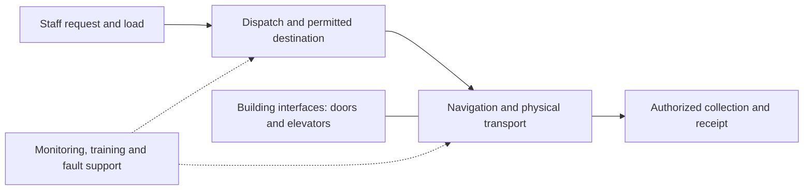

# Hospital logistics: compare the system, the contract and the support

Reviewed 15 September 2026. This is a comparison of **hospital point-to-point material delivery** by EPS/易普森, Saite/赛特 and Tami/塔米. It excludes surgical, diagnostic, reception and disinfection robots, and pneumatic-only transport. The selected records are not a market-share sample, a head-to-head performance test or proof that the products are interchangeable.

**A useful commercial comparison starts with the installed delivery system and its customer relationship.** These cases expose different parts of that system: named robot purchases through a separate seller, human handoffs and building interfaces, proposed annual support, and supplier-reported military-hospital awards. Together they make a support application of the broader autonomy stack concrete. They do not establish one supplier's technical superiority or a common cost per delivery.

## Three suppliers performing a comparable function

| Supplier family | Specific customer evidence | Commercial role visible | Strongest stage and unresolved boundary |
|---|---|---|---|
| **EPS / 易普森** | Dushu Lake Hospital's robot lot names EPS-D2 and EPS-Y2-M4. | Contract seller **苏州明逸智库信息科技有限公司** is distinct from the printed brand. | Matched award and contract notices; five-year warranty obligation. Original signed attachment and acceptance record were not obtained. [HL01] |
| **Saite / 赛特** | Wenzhou and Jiuquan delivery cases; a separate Shunde buyer seeks continuing logistics-system support. | Shunde proposes **广州赛特智能科技有限公司** as its sole maintenance supplier. This does not identify the original hardware seller. | Supplier-reported delivery/use plus a buyer's maintenance proposal; no matched award, payment or measured support result. [HL02–HL04] |
| **Tami / 塔米** | Two dated company announcements name **陆军军医大学西南医院**. | Tami attributes the awards to cooperation with **中电智安科技有限公司**; the contract workshare is undisclosed. | Positive supplier-reported military-hospital relationship. Buyer award, signed contract and acceptance remain unverified. [HL08–HL09] |

EPS's current site footer names **易普森智慧健康科技（深圳）有限公司**; Tami's names **杭州塔米机器人有限公司**. A present website operator is not sufficient to assign the exact legal manufacturer or historical contracting entity. Keep those fields unresolved where the purchase record does not name them. Tami/塔米 is also distinct from similarly transliterated 钛米. [HL07–HL09]

## What the purchases and support actually measure

**EPS: a robot lot has both individual items and a package price.** For **SZWK2023-Y-G-046-003**, the 26 January 2024 award lists six EPS-D2 units at RMB568,000 each and one specimen-transport EPS-Y2-M4 at RMB228,000, followed by an ellipsis. The lot totals **RMB5,476,100**. Contract notice **H243273** records signature on **21 February**, publication on **23 February**, and five years of warranty. [HL01]

The listed seven units sum to **RMB3,636,000**; the **RMB1,840,100** balance cannot be classified as software, integration or margin from an abbreviated item list. Nor is dividing the entire package by seven a robot unit price. The warranty is an obligation, not five years of demonstrated service or a separately priced support subscription. This calculation illustrates why an apparently precise bill of materials can be misleading when the underlying scope is incomplete.

**Saite: support is a separately budgeted purchase.** On **26 June 2025**, 暨南大学附属顺德医院 published **ZBCGZX-XXK-2025-049**, proposing **RMB264,000 per year** for its logistics-robot system's IT support. The requested work includes monitoring, inspection of the operating environment and fault handling. Its sole-source rationale invokes uniqueness and procurement efficiency, without explaining a technical barrier to replacement. [HL04]

That establishes a buyer's willingness to budget continuing system support. It does not establish contracted recurring revenue, margin, proprietary lock-in or a per-robot maintenance cost. Fleet count, model, hardware-replacement coverage, service response commitments and a final contract term are missing. The Shunde budget must not be divided by another hospital's robot count or EPS's purchase price.

## Follow a delivery through the autonomy stack

Saite's **6 September 2021** Wenzhou Eye Hospital case identifies **智赛拉 B1** for specimen transport. Staff initiate a request, load the material and confirm dispatch; the robot travels and uses elevators; laboratory staff retrieve and acknowledge receipt. The product description identifies permissions and tracking, says door interaction requires an added IoT module, and shows engineers training users. These are company-reported functions and work, without a buyer acceptance test. [HL02]

Its **26 September 2024** Jiuquan case reports a second phase in use, distinguishing integrated delivery robots from robots carrying detachable racks. Staff loading and authenticated collection remain visible; rack unloading is described as automated. A second deployment phase is not automatically a second contract, the same product generation or evidence of lower installation cost. [HL03]

The diagram is an analytical decomposition of these workflows, not an asserted architecture shared by all three suppliers:

This makes three distinctions useful for the wider doctrine research. **Accountability** for the task, **permission** to request or collect it, and **automation** of travel are different properties. A delivery can involve autonomous movement and retained human loading. A credential-controlled compartment is evidence about access, not a general machine decision policy. These civilian workflows clarify the questions to ask of military support systems; they do not establish PLA-wide rules.

## Operation is observable even when the commercial chain is incomplete

On **7 January 2026**, **襄阳市中医医院** reported four transport robots in use at its **东津院区**, including a site arrangement for dedicated robot elevator service. The hospital did not name their manufacturer or model. A Hubei Daily report published **14 February** describes four robots transporting medicines and specimens there on **11 February**. This is additional on-site reporting of use, not an independently measured productivity study. [HL05–HL06]

EPS's **21 August 2026** case attributes four robots introduced in late 2025 at that hospital to itself and reports **35,000 cumulative deliveries** by an unspecified recent cutoff. It describes three robot categories and a management system for dispatch, monitoring and analysis. The maker attribution and total remain supplier-reported. The buyer and reporter corroborate operation at the site; they do not validate those additional claims. These are not identified as Dushu Lake's models. [HL07]

This is positive evidence of a functioning civilian delivery application. It still lacks a denominator of attempted tasks, failed trips, human recoveries and all-party working hours. Completed deliveries can grow while support remains substantial—or while cost per task falls. Both explanations remain testable.

## A military-hospital connection, with its attribution preserved

Tami's **27 November 2024** announcement claims a first-phase award with its named partner for delivery from Southwest Hospital's intravenous preparation center to wards. It describes a V-Smart management platform and hospital information-system integration. Those are the supplier's system claims; a software version and installed configuration are undisclosed. [HL08]

Its **15 January 2025** announcement claims a second-phase award with the same partner. The described package includes **three delivery robots and one medicine-management cabinet**. The release does not provide prices, acceptance evidence or independently measured benefits. The publication dates are not exact award dates. [HL09]

This is a concrete claimed route from a commercial service-robot supplier through a partner into military healthcare. It is stronger than generic technical relevance, while remaining weaker than a matched buyer-confirmed contract. **It is not matched to procurement record P04:** the announcements do not give P04's project number. The [military hospital tender](procurement.md#p04--prior-hospital-deployments-as-a-qualification-requirement-2024-jl1303-w10136) remains a separate requirement record. Shared place, timing and wording cannot substitute for the join.

No military relationship is established for the EPS and Saite cases used here. That is a statement about this evidence, not a claim that the companies have no such business. Military hospital logistics also does not establish tactical deployment or common software with combat systems.

## What this comparison lets an analyst test

| Commercial hypothesis | What the evidence contributes | Observation that would discriminate |
|---|---|---|
| Hardware sales create a continuing support opportunity. | A purchase includes warranty; another buyer separately budgets system support. | Same-customer purchase, warranty expiry, support award and actual payments, with work scope preserved. |
| The integrator or reseller controls access to the customer. | A named contract seller differs from the brand; another supplier describes cooperation with a named partner. | Who signs, invoices, installs, controls interfaces and answers service calls; each party's revenue and costs. |
| Repeat installations reduce the work required. | Suppliers report multiple sites and deployment phases, with visible building interfaces and training. | Same-generation deployments with measured reused work, new engineering, acceptance time and support hours. |
| Installed software makes supplier replacement costly. | A buyer requests sole-source support, but does not disclose the technical reason. | Data export rights, configuration access, documented interfaces, alternative bids and an actual migration estimate. |

These questions are more discriminating than ranking suppliers by a broad autonomy score. The strongest current finding is **a commercial system spanning equipment, workflow integration and support**. The remaining economic question is which of those activities becomes cheaper with repetition, and which party captures the benefit. The [adoption routes](adoption-routes.md) and [task-economics method](../industrial-base/task-economics/method.md) provide the larger framework.

## Primary sources and access

All checked 15 September 2026. Publication and event dates are separated above. Summaries are analytical translations; no performance claim is treated as an audited operating result.

| ID | Original source and locator | Source status and access |
|---|---|---|
| HL01 | [Suzhou government procurement](https://czju.suzhou.gov.cn/zfcg/html/project/59b6dcd155a24dd384ca40d54adfa3b1.shtml), award §§I–IV and contract notice §§I, III, V–VIII. [National duplicate award](https://www.ccgp.gov.cn/cggg/dfgg/cjgg/202401/t20240126_21481758.htm). | Complete indexed official notices inspected. Direct downloads returned 403; contract PDF and award ZIP were not retrieved. Duplicate publication is one underlying award, not independent corroboration. |
| HL02 | [Saite Wenzhou B1 case](https://www.saiterobot.com/dongtai/221.html), 6 September 2021, solution, workflow and training caption. | Complete original company HTML downloaded and read. Product-feature text is not a tested installed configuration. |
| HL03 | [Saite Jiuquan case](https://www.saiterobot.com/dongtai/395.html), 26 September 2024, opening and §§01–03. | Complete original company HTML downloaded and read; delivery functions separated from other robot categories. |
| HL04 | [Shunde hospital maintenance notice](https://www.sddermyy.com/newsinfo/8472806.html), 26 June 2025, §§I–III. | Complete indexed buyer notice inspected. Direct access failed, including certificate verification; no original archive obtained. |
| HL05 | [Xiangyang hospital report](https://www.xyszyyy.cn/info/1060/8655.htm), 7 January 2026, opening and elevator paragraph. [Indexed hospital-domain copy](https://www.xyszyyy.com/info/1060/8655.htm). | Substantive indexed hospital body inspected; direct retrieval failed. No manufacturer named. |
| HL06 | [Hubei Daily on-site report](https://news.hubeidaily.net/mobile/c_5158313.html), 14 February 2026, sole reporting paragraph. | Original reporter/correspondent account read in full; observation dated 11 February. |
| HL07 | [EPS Xiangyang case](https://epshealth.com/News/news_100000124122293.html), 21 August 2026, introduction, management section and footer. | Complete original page read through web tool. Supplier attribution and operating totals remain separate from buyer reporting. |
| HL08 | [Tami first-phase announcement](https://www.tamigroup.com/h-nd-166.html), 27 November 2024, opening and platform paragraph. | Complete official-origin HTML downloaded over HTTP after HTTPS certificate mismatch; read in full. |
| HL09 | [Tami second-phase announcement](https://www.tamigroup.com/h-nd-168.html), 15 January 2025, opening and package paragraph. | Same original-access method; complete body read. No corresponding buyer result obtained. |

For reproducibility, the original HTML files retained during review have the following SHA-256 hashes; they are not redistributed with this sourcebook:

| Source | SHA-256 |
|---|---|
| HL02 | `b6ca905200bbaab2450658a7d2263665a6282f12d3233b27572b54cd0eefb890` |
| HL03 | `acd4444a935d5d9dde6e9e180e43a49dbf6fe0b8393e4a84df66d754f5d117c0` |
| HL08 | `814d9d2cd4d86aba59c07b4ae762b6ef6beb5b0028c5cede0f11a56d53174222` |
| HL09 | `590901dd73dd16714b86aceacccbb13ae58f8e76a2f22405ff9399be9ecb62a7` |

Searches used the supplier names, exact hospital names, project identifiers, and Chinese terms for logistics robots, awards, acceptance and maintenance. They were deliberately bounded to this function. Unretrieved records may exist. The Noah/Wanzhou maintenance and Saite/Hainan shipment leads were not promoted from secondary indexes into verified customer records.
