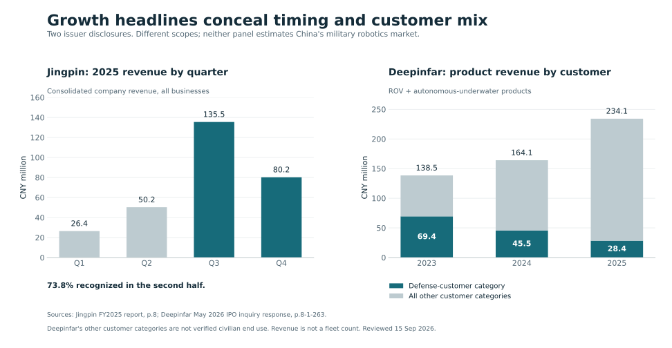

# Orders, revenue and operating scale tell different stories

Reviewed 15 September 2026. Two issuer cases add measured commercial activity to the [ecosystem guide](README.md). They establish real business and repeat purchases while challenging the use of company growth as a proxy for military robotics demand. The [data panel](scale-panel.json) preserves original units, reporting scopes, source locators and missing values.

The panels answer different questions. Jingpin illustrates revenue timing across one year; Deepinfar illustrates customer mix over three years. Their denominators differ, and neither is a national market estimate.

## Jingpin: accepted business, changing labels and uneven revenue timing

Amounts are CNY million, rounded here; the data file retains source precision.

| Measure | 2024 | 2025 | Scope |
|---|---:|---:|---|
| Total company revenue | 163.7390 | 292.3316 | Consolidated, all businesses |
| Disclosed robot category | 39.8401 | 140.2156 | 2024 label **军用机器人**; 2025 label **特种机器人** |

The company reports **251.95% robot-product revenue growth**; the label change alone does not prove a statistical break. A military-only, constant-scope growth rate cannot be isolated from these categories and their described applications. The separately disclosed **CNY127.5538m** robot figure is parent-company revenue, not consolidated revenue. Sources: [FY2024 report, p.35](https://static.cninfo.com.cn/finalpage/2025-04-29/1223380866.PDF); [FY2025 report, pp.7, 32, 229](https://static.cninfo.com.cn/finalpage/2026-04-28/1225210584.PDF).

**Timing matters.** Calculated from reported quarters, **73.8% of 2025 revenue arose in the second half**. The accounting policy permits recognition after customer acceptance and designated storage at the company's warehouse, before customer pickup; later price review can trigger a current-period revenue adjustment. An accepted sale therefore need not equal delivery to an operating unit in the same period. [FY2025, pp.8, 141](https://static.cninfo.com.cn/finalpage/2026-04-28/1225210584.PDF).

The current comparison is H1 against H1: **CNY74.2032m in H1 2026**, down **3.20%** from CNY76.6539m. H1 2026's robot-category revenue was CNY16.1301m. These unaudited figures should not be doubled into an annual forecast. [H1 2026, pp.6, 154](https://static.cninfo.com.cn/finalpage/2026-08-25/1225497124.PDF).

**Industrial interpretation:** accepted business is visible, but a financial series mixes customer schedules, product scope and accounting timing. Connect an exact product/customer contract to these observations before estimating unit shipments, deployment speed or a military market. The existing [Jingpin study](../autonomy/cases/ownership-and-software.md) separately establishes that published volume is labor-equivalent accounting and that a warehouse-software tender objective remained a target.

## Deepinfar: growing product revenue alongside a shrinking defense-customer category

The issuer's ROV/autonomous-underwater product revenue includes more than the three named series below. It excludes technical services and consumer propulsion products. **国防客户 / defense customers** is its customer-type category; **海洋安全 / marine security** is a different final-use classification.

| Year | ROV/AUV product revenue, CNY m | Defense-customer revenue, CNY m | Defense-customer share |
|---|---:|---:|---:|
| 2023 | 138.4728 | 69.4366 | 50.14% |
| 2024 | 164.0999 | 45.5416 | 27.75% |
| 2025 | 234.1415 | 28.3967 | 12.13% |

This product business grew **69.1%** over the period while its defense-customer revenue fell **59.1%**. These are calculated, company-specific changes—not total military-demand changes. Other customer categories may contain intermediaries or research institutions whose ultimate use differs. [IPO inquiry response, 15 May 2026 version, printed p.8-1-263](https://static.sse.com.cn/stock/disclosure/announcement/c/202605/002155_20260515_R7G5.pdf).

The series data retain the issuer's **套 / sets** denominator and exclude its separately booked customized-product category and parts. Configurations within a series can still differ.

| Series | 2023 sold / revenue CNY m | 2024 sold / revenue CNY m | 2025 sold / revenue CNY m |
|---|---:|---:|---:|
| Haiyi | 5 / 2.7212 | 19 / 17.3761 | 24 / 16.6513 |
| Orange Shark | 4 / 6.9456 | 21 / 57.3215 | 24 / 53.4143 |
| Black Shark | 1 / 2.6549 | — / — | — / — |

Dashes preserve the source. Haiyi and Orange Shark sold more sets in 2025 while revenue declined; configuration differences prevent calling this a constant-product price cut. [Response, pp.8-1-55, 70–72](https://static.sse.com.cn/stock/disclosure/announcement/c/202605/002155_20260515_R7G5.pdf).

**Repeat purchases also appear:** the filing names CAS's South China Sea Institute of Oceanology for Haiyi, a Haiyi sales-channel company, and anonymized defense customer HGD for Orange Shark. Their cumulative customer-table quantities include mixed units and accessories. A separate unnamed-model glider order was shipped in June 2025 but recognized in November, following project acceptance. These strengthen the evidence for a continuing business while preserving the distinction between sales, shipments and operating fleets. [Response, pp.8-1-251, 266, 268–269, 322–323](https://static.sse.com.cn/stock/disclosure/announcement/c/202605/002155_20260515_R7G5.pdf).

## What this changes about the ecosystem

There is measurable adoption, including repeat purchases by an issuer-identified defense customer. There is also divergence between overall business growth, military-related customer revenue, product quantities and recognition dates. An analyst should explain that divergence before extrapolating from a successful platform or a large procurement headline.

Three useful comparisons follow:

1. **Same scope over time:** preserve category labels, consolidation boundary, period and customer type. A national estimate also needs to remove transactions between primes, integrators and suppliers.
2. **Same product through milestones:** follow order, shipment, acceptance, revenue and payment separately. None alone measures routine autonomous operation.
3. **Same workflow across deployments:** assess repeatability and all-party operating work. The [contrary cases](thesis-tests.md) show why retained human authority can coexist with low direct staffing and substantial civilian fleet scale.

## Source access and reproduction

All figures are issuer disclosures. Jingpin's FY2024, FY2025 and H1 2026 PDFs were downloaded from issuer-document mirrors; the financial tables used here were visually inspected. H1 2026 is explicitly unaudited. The Deepinfar response's relevant tables were downloaded and visually checked; the version date follows its SSE filename and does not imply no later filing exists.

The panel preserves byte hashes, source-unit conversions and locators. Its customer records are cumulative, not annual deliveries. An Orange Shark use-category rounding difference of CNY100 is retained. One internally inconsistent Tianjin customer delivery row was excluded from model attribution. The figure is reproducible with [the figure builder](../../scripts/plot-robotics-scale.py); primary reports are not redistributed.
